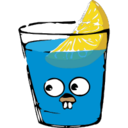

## Hey! Nice to see you. :cyclone:
  
Welcome to my page! 

### My name is Tsix.
  - My day job is [coding](https://github.com/tsix2019),  and I like to go fishing during the holidays.

### ✋ Brief Introduction
  

    
  

### ❤️ Hobby
  - 🚴‍♀️
  - 🎣
  - 🍵
  - 📈

### 💭 Contact me
  
  - 📫 [tsix2019@gmail.com](https://github.com/tsix2019)

  - 🍀 [T00111100](https://github.com/tsix2019)

### ⚡ Programming language

I'm mostly working on front-end web development, using <strong>JavaScript</strong>🔩. 
Occasionally also uses <strong>Go</strong>👍.

  

    
  

### 📦 framel

  
  
  
  
  
  

  

    
  
