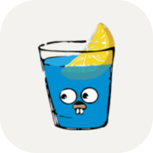

<h1>Hi, I'm Tsix 👋</h1>

## 🙋 关于我

- 📍 安徽 · 芜湖
- 💼 前端开发，主力 JavaScript，偶尔写 Go
- 🔭 最近在做 [safeIP](https://github.com/tsix2019/safeIP) 和 [dicar2](https://github.com/tsix2019/dicar2)
- ❤️ 🚴 骑行 · 🎣 钓鱼 · 🍵 喝茶 · 📈 炒股

## 🛠 技术栈

  <picture><source media="(prefers-color-scheme: dark)" srcset="./icons/VueJS-Dark.svg" /></picture>
  <picture><source media="(prefers-color-scheme: dark)" srcset="./icons/NuxtJS-Dark.svg" /></picture>
  <picture><source media="(prefers-color-scheme: dark)" srcset="./icons/React-Dark.svg" /></picture>
  <picture><source media="(prefers-color-scheme: dark)" srcset="./icons/NodeJS-Dark.svg" /></picture>
  
  
  <picture><source media="(prefers-color-scheme: dark)" srcset="./icons/Gin-Dark.svg" /></picture>
  <picture><source media="(prefers-color-scheme: dark)" srcset="./icons/Java-Dark.svg" /></picture>
  <picture><source media="(prefers-color-scheme: dark)" srcset="./icons/Kotlin-Dark.svg" /></picture>

## 📌 精选项目

<!-- 卡片要可点击，所以不能用 <picture>（套在 <a> 里会被 GitHub 拆开），改用透明背景，深浅色通用 -->

  
  

## 📊 GitHub 数据

  <picture>
    <source media="(prefers-color-scheme: dark)" srcset="https://github-profile-summary-cards.vercel.app/api/cards/profile-details?username=tsix2019&theme=github_dark" />
    
  </picture>

  <picture>
    <source media="(prefers-color-scheme: dark)" srcset="https://github-readme-stats.vercel.app/api?username=tsix2019&show_icons=true&theme=github_dark&border_color=30363d" />
    
  </picture>
  <picture>
    <source media="(prefers-color-scheme: dark)" srcset="https://github-readme-stats.vercel.app/api/top-langs/?username=tsix2019&layout=compact&theme=github_dark&border_color=30363d" />
    
  </picture>

  <picture>
    <source media="(prefers-color-scheme: dark)" srcset="https://github-profile-summary-cards.vercel.app/api/cards/productive-time?username=tsix2019&theme=github_dark&utcOffset=8" />
    
  </picture>

  <picture>
    <source media="(prefers-color-scheme: dark)" srcset="https://raw.githubusercontent.com/tsix2019/tsix2019/output/github-snake-dark.svg" />
    
  </picture>

